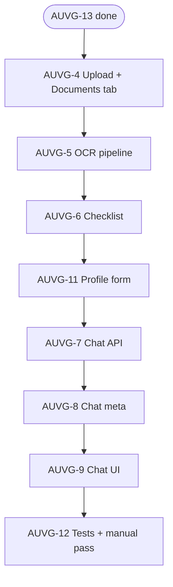

### MVP – Remaining Tasks and Order

- Completed: [[AUVG-1]], [[AUVG-2]], [[AUVG-3]], [[AUVG-13]]
- Merged: [[AUVG-10]] → included in [[AUVG-4]]

#### Ordered task list (to reach MVP)

1. [[AUVG-4]] — Document upload and management (application‑scoped)
   - Drag & drop upload UI; `POST /api/applications/[id]/documents`
   - Documents tab (`?tab=documents`) with list, inline preview, Reprocess
2. [[AUVG-5]] — OCR pipeline (app‑scoped, sync trigger + persist)
   - `POST /api/applications/[id]/documents/[documentId]/ocr`; status → completed/failed; `ocr_results`
3. [[AUVG-6]] — Eligibility and required‑docs checklist definitions
   - Typed schema + seed (e.g., 191); `GET /api/checklists/[visa]`
4. [[AUVG-11]] — Minimal application profile form (Profile tab)
   - Form under `applications/[id]` Profile; `PATCH /api/applications/[id]`
5. [[AUVG-7]] — Chat API (no retrieval, app‑scoped)
   - `POST /api/applications/[id]/chat` composes profile + OCR + checklist; streams
6. [[AUVG-8]] — Confidence, action items, missing‑docs (meta)
   - Extend chat response meta; persist snapshot on application
7. [[AUVG-9]] — Chat UI with streaming and structured results
   - Select application and optional documents; panels for meta; calls app‑scoped chat
8. [[AUVG-12]] — Tests and manual test pass for MVP slice
   - Vitest + RTL (upload/UI), integration (OCR, chat), Playwright e2e (upload → OCR → chat)

#### Flow (Mermaid)

Notes:

- Documents and routes are strictly application‑scoped.
- The Documents tab is deep‑linkable via `/applications/[id]?tab=documents`.
